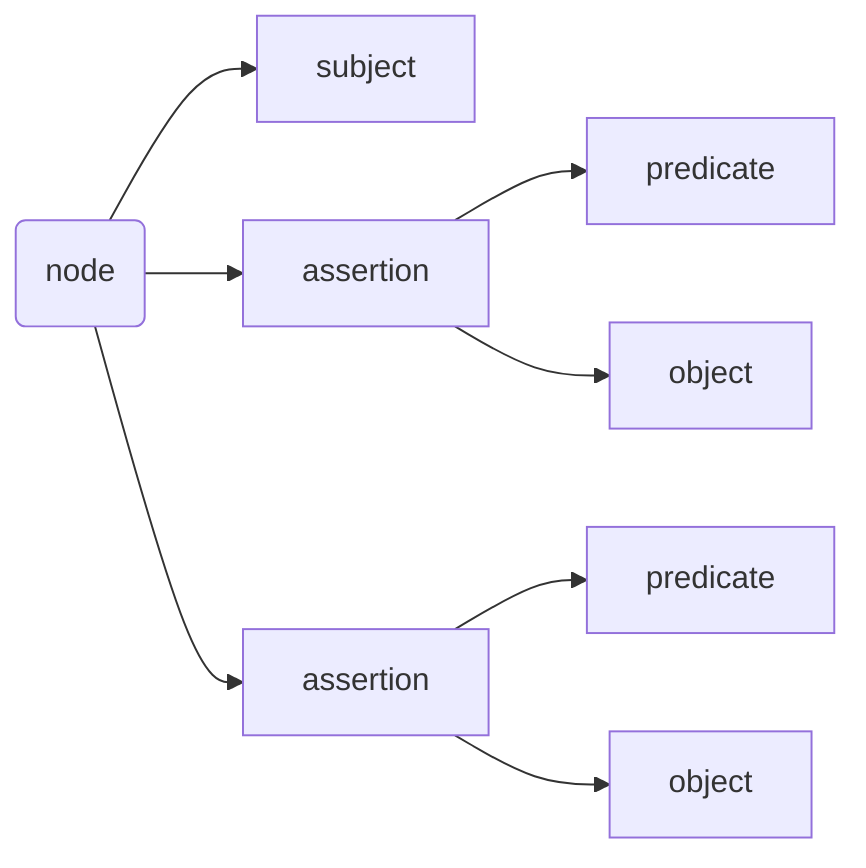
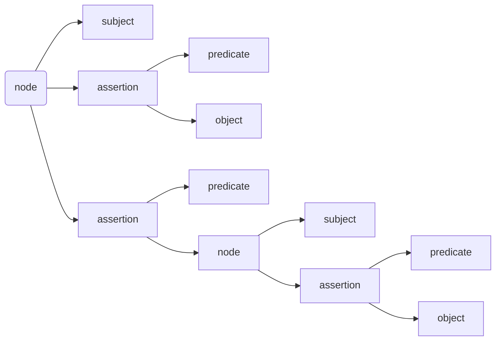
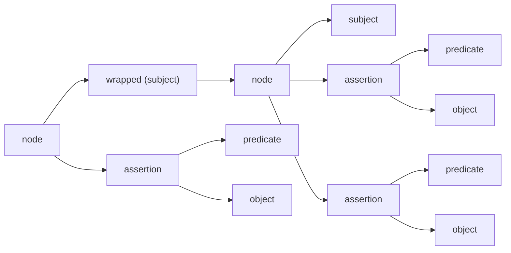

# How To Use Attachments with ZeWIF v1.0 (5/7/25)

The ZeWIF data format is built on [Gordian Envelope](https://developer.blockchaincommons.com/envelope/). This provides it with access to many additional features that might not be utilized in the first iteration of the ZeWIF standard but which may be of use in the future, including compression and elision and the ability to securely transmit files with [GSTP](https://developer.blockchaincommons.com/envelope/gstp/).

Another special feature of Envelope is the "attachment", defined in [BCR-2023-006](https://github.com/BlockchainCommons/Research/blob/master/papers/bcr-2023-006-envelope-attachment.md) and summarized here. Attachments are used in ZeWIF, specifically to store content for certain data classes. Attachment points are available in many parts of the ZeWIF structure, including the top-level structure.

## Data Classes in ZeWIF

ZeWIF organizes data into three classes:

* **Class I.** Data that is stored by two or more different wallets and is considered important and up-to-date.
* **Class II.** Data that is stored by less than two wallets or that is considered less important or less up-to-date.
* **Class III.** Data that is considered unimportant, not up-to-date, and is typically not in use by multiple wallets.

Class I data is defined in the ZeWIF spec. All data imported from `zcashd` is believed to fall into this class. It can be encoded by the `zewif` crate and is marked with Envelope typing, using the `isA` statement. Class I data structures also often include attachment points so that related data that is not Class I can be stored near to its peers. Class II data should still be stored as part of a ZeWIF file, but is not specified, so the storage is done through attachments. Class III data is not considered important enough to store, but should still be maintained as part of an attachment containing the entirety of the original wallet data file that is being migrated.

To clarify attachments may be found in two places in a ZeWIF data file:

* **Top-Level Attachments.** The Zewif structure includes an attachment point for top-level content. [Best practices](bestpractices.md) suggest that a copy of the original data file be kept here. Additional data not relevant to a structure attachment might also be included here.
* **Structure Attachments.** Individual lower-level structures also include attachments points when there was thought to be reason to include additional data or metadata on the topic that nonetheless was not Class I.

After a ZeWIF data file is output, additional attachments could also be made using the [`envelope-cli-rust` tool](https://github.com/BlockchainCommons/bc-envelope-cli-rust) or other means to adjust a Gordian Envelope file.

## Envelope Technical Overview

The [Gordian Envelope](https://developer.blockchaincommons.com) base specification is defined in an IETF Internet-Draft [draft-mcnally-envelope](https://datatracker.ietf.org/doc/draft-mcnally-envelope/), and is extended through a number of extensions defined in the [Blockchain Commons Research Repo](https://github.com/BlockchainCommons/research). This is the format that is used for at-rest storage of ZeWIF content. Understanding of the Envelope data format is _not_ required to use ZeWIF, even if input is occurring from ZeWIF data files or output is occurring to ZeWIF data files. The `zewif` crates, `zmigrate` tool, and associated docs should be all that are required to make use of ZeWIF.

Nonetheless, the following major points are useful as an overview of Gordian Envelope:

* **Envelope Uses CBOR.** Gordian Envelope is built using CBOR, a [well-specified](https://cbor.io/) and mature binary data representation format. Every Envelope is not only [legal CBOR](https://datatracker.ietf.org/doc/html/rfc8949), but also [legal dCBOR](https://datatracker.ietf.org/doc/draft-mcnally-deterministic-cbor/), a deterministic version of CBOR. Every Envelope, and therefore every ZeWIF file, can be read using CBOR tools such as [cbor.me](https://cbor.me/). (But don't read ZeWIF files containing private keys in an online site!)
* **Envelope Stores Data in a Merkle-Like Tree.** Gordian Envelope is a hierarchical tree structure. Central nodes lead to multiple branches and eventually to leaves, which can be any CBOR data from simple integers or strings all the way to complex structures (including Gordian Envelopes!) This allows for the organized storage of data. The tree is Merkle-like because every node is associated with a unique digest, which can be used to prove the data that lies under it (a benefit which may not be relevant for the first iteration of ZeWIF, but which allows for powerful elision and signatures).
* **Envelope is Built on Semantic Triples.** Data is stored in a Gordian Envelope as a semantic triple of subject-predicate-object. Each predicate-object pair is called an assertion. An envelope is a subject about which zero or more assertions may be made. A node connects together a subject with its set of assertions.


* **Envelope Can Be Recursive.** Any subject, predicate, object, or assertion can itself be an Envelope (a semantic triple). This allows for fully recursive structures to improve organization.



* **Envelope Can Be Stored as a UR.** Blockchain Commons [Uniform Resource (UR) format](https://developer.blockchaincommons.com/ur/) supports the text encoding of CBOR data. This can be used to store a ZeWIF Envelope file and to encode it as a QR or an [Animated QR](https://developer.blockchaincommons.com/animated-qrs/). This can resolve issues of secure transmission across air gaps.
* **Envelopes Can Be Signed.** Envelopes can be "wrapped" and then signed. This is not currently utilized by ZeWIF, but could be used in the future to guarantee the authenticity of a ZeWIF file. The separate [envelope command line tool](https://github.com/BlockchainCommons/bc-envelope-cli-rust) may also be used to sign ZeWIF files and verify signatures.
* **Envelope Digests Allow Data to Be Elided.** Some or all data in an Envelope can be elided. Digests of elided data remain, allowing for proof of content and proof of signature. This is another Envelope feature not currently utilized by ZeWIF, but that might have future usefulness. Again, the [envelope command line tool](https://github.com/BlockchainCommons/bc-envelope-cli-rust) can be used to access this functionality.

### Wrapped Envelopes

A "wrapped" envelope is an Envelope that has been turned into a subject for a new envelope. This allows assertions to refer to the entire content of the original envelope, including its own assertions.



This feature is a crucial element of an attachment.

## Attachments Technical Overview

Attachments are fully described in [BCR-2023-006](https://github.com/BlockchainCommons/Research/blob/master/papers/bcr-2023-006-envelope-attachment.md). The technical information here will usually not be needed, as the `zewif` crate has APIs that handle the addition and extraction of attachments. However, it may be useful to understand the underlying structure of an attachment.

Attachments make use of Envelope wrapping (described above) and of [known values](https://github.com/BlockchainCommons/Research/blob/master/papers/bcr-2023-002-known-value.md), which are a namespace of 64-bit integers registered with Blockchain Commons and used to convey specific concepts in a precise, compact way.

* An attachment is an assertion in an envelope, meaning that it contains a predicate and an object.
* The predicate of an attachment is a specific known value #50, which is registered as `attachment`.
* The object of an attachment is the payload of attachment data.

When creating a payload for a ZeWIF attachment you might simply dump in the otherwise unspecified data as a binary blob, matching whatever format the data was held in in the originating wallet. It's better to simplify and standardize it as much as possible as discussed in the [ZeWIF best practices](bestpractices.md#attachments). Because an object can be a full Envelope, it's also possible to create an entire recursive data structure as the object of an attachment.

* Once an attachment has been created, the Envelope is wrapped, turning it into the subject of a new Envelope.
* A `vendor` assertion MUST be added. This is a predicate of known value #51 with the object of a string for the vendor name.
* A `conformsTo` assertion MAY be added. (It's [strongly recommended](https://github.com/BlockchainCommons/zmigrate/blob/master/docs/bestpractices.md#attachments) for ZeWIF attachments.) This is a predicate of known value #52 with the object being a string that identifies the format of the attachment.

That's it! You have an attachment! And, if you're using the `zewif` crate you don't even need to know these specifics, you just use the `attachments.add` function on any `zewif` structure with an `attachments` field. The API is inherited from the [envelope API](https://github.com/BlockchainCommons/bc-envelope-rust/blob/master/src/extension/attachment/attachments.rs):
```
attachments.add(payload,vendor,conforms_to);
```

You should create attachments for all of the data in your wallet that is not defined by the ZeWIF spec.

### Defining `vendor` and `conformsTo`

**`vendor`** must be a unique name identifying the vendor of the wallet. It's suggested as a reverse domain name, such as `org.zingolabs`.

**`conformsTo`** is not required, but it is highly recommended, especially for ZeWIF data, since it's crucial that it be understandable in the future. It's recommended as a URL that contains the specification describing what the data is and how it's encoded. By storing this info at a URL, you can sure it's recoverable in the far future. Even if your site is gone, [archive.org](https://archive.org) or similar services may have a copy.

### Versioning `conformsTo`

Your `conformsTo` should be versioned so that a user or importer can look up the precise version that data was encoded with. One way to do so is to ensure that the URL referred to in `conformsTo` includes a version, with different versions going to different URLs. This will allow for the future lookup of a specific version of the `conformsTo` URL using a service such as archive.org. See [best practices](bestpractices.md#attachments) for more.

### Adding Other Metadata

Other assertions can be added to the payload Envelope before it's attached to the ZeWIF structure. This might include notes about the contents, warnings, or even instructions for their use to supplement the `conformsTo` information. Anything that might be helpful to later recovery of the data should be considered for addition.

## Encoding a Structure Attachment

Once you've created an attachment with a `vendor` and a `conformsTo`, all you need to do is attach it to an appropriate place in the ZeWIF structure. These are defined throughout the API docs. You should choose the part of the ZeWIF structure that is most closely associated with the data you're storing. So Class II address data would go with an address, class II account data would go with an account, and otherwise unstructured data (including the class III copy of the entire data file) would go in the top-level ZeWIF structure.

Here's a sample of what the `Account` structure looks like at the time of this writing, complete with `attachments` point:

```
pub struct Account {
    index: usize,
    name: String,
    birthday_height: Option<BlockHeight>,
    birthday_block: Option<BlockHash>,
    zip32_account_id: Option<u32>,
    addresses: Vec<Address>,
    relevant_transactions: HashSet<TxId>,
    sapling_sent_outputs: Vec<SaplingSentOutput>,
    orchard_sent_outputs: Vec<OrchardSentOutput>,
    attachments: Attachments,
}
```

Similarly, here's the top-level ZeWIF structure:
```
pub struct Zewif {
    id: ARID,
    wallets: Vec<ZewifWallet>,
    transactions: HashMap<TxId, Transaction>,
    export_height: BlockHeight,
    attachments: Attachments,
}
```

For more information on attachments, see the Cargo docs for Envelope and for ZeWIF as well as the [Envelope Internet-Draft](https://datatracker.ietf.org/doc/draft-mcnally-envelope/) and the [Attachment spec](https://github.com/BlockchainCommons/Research/blob/master/papers/bcr-2023-006-envelope-attachment.md).
