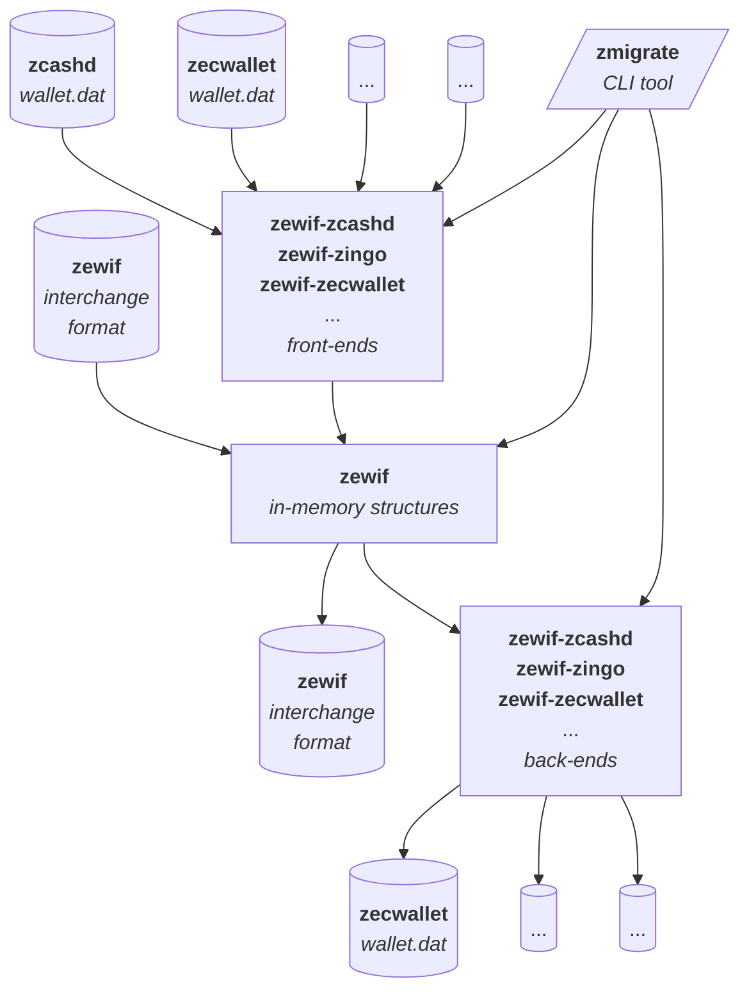

# Best Practices for Importing & Exporting Wallet Data
### V1.0 (5/7/25)

The ZeWIF format is a specification for the import and export of Zcash wallet data, enabling [interoperability](https://www.blockchaincommons.com/musings/musings-interop/) among wallets and creating freedom for users.



As the above diagram shows, the `zewif` Rust crate lies at the center of the ZeWIF system. It creates in-memory representations of data from a variety of inputs and can output that abstracted data in a number of forms. Obviously, it can accept input from ZeWIF files (based on Gordian Envelope) and it can output to ZeWIF files. However, that's just part of the process. Individual developers can also choose to use create front ends that import data from their wallets to `zewif` and back ends that export the data from `zewif` to their wallets.

The following best practices offer suggestions for those front-end and back-end wallet developers, to ensure that their data remains not just maximally interoperable, but also maximally accessible, now and in the far future.

## The Core Format

***[Export:] Use Defined Object Types.*** The `zewif` crate allows for the creation of a variety of Zcash-specific objects. Some of these have `::new` functions while others are instantiated by converting them from other (frequently serialized) forms using `ZcashType::from(other_form)` functions. A few allow individual properties to be set after instantiation.

A ZeWIF file is a hierarchy of Gordian Envelopes, and some of the `zewif` structures are defined entirely in terms of assertions on envelopes. These are marked with an `isA` assertion that identifies their type, and this is checked whenever the data is deserialized. Other (usually simpler) structures are defined as CBOR objects, which are always the leaves of an envelope tree.

* _Example:_ The following examples show creations of an account and an address:

```rust
let mut account = Account::new();
let t_addr = transparent::Address::new("t1exampleaddress");
```

***[Export:] Break Apart Composite Data When Appropriate.*** Wallets may store data as composite objects containing multiple individual keys and values. When exporting, these may need to be broken apart rather than stored as a single blob. Consult the ZeWIF documentation to determine the appropriate approach:

1.  **Combined Data Type Exists:** If ZeWIF defines a data type for the composite datum (typically when Zcash officially specifies it), use this combined data type.
2.  **Individual Data Types Exist:** If ZeWIF provides data types for each part of the composite datum, store each part individually using its corresponding data type.
3.  **Partial or No Data Types Exist:** If ZeWIF lacks data types for some or all individual parts, break down the composite datum as much as is logical. Store elements with existing ZeWIF data types accordingly. For the remaining elements, store each as an individual attachment, adhering to best practices for attachments.

* _Example:_ `zcashd`'s CKeyMetaData contains a seed fingerprint (uint256), a creation date (UNIX timestamp), and an HD/ZIP-32 Keypath (string). ZeWIF allows for the individual storage of `version`, `create_time`, `hd_keypath`, and `seed_fp` as part of the `KeyMetadata` structure. By storing the content individually, instead of as a blob, we make them more accessible in the future.

***[Import:] Destroy ZeWIF Files after Importing.*** After importing a ZeWIF file, you should remind users to destroy it once they determine they no longer need it, as it will usually contain sensitive information. An alternative is to ***Encrypt for Storage*** as discussed below.

## Key Migration

***[All:] Use Account Abstractions.*** Zcash utilizes different types of cryptographic keys. Some are non-deterministic keys generated using system randomness, while others are Hierarchical Deterministic (HD) keys derived from a master seed. Most Zcash wallet software presents these keys to users grouped into 'accounts' for better asset organization. These accounts can encompass a series of related HD keys (e.g., addresses derived from a specific path in an HD tree), individual non-deterministic keys, or a combination thereof. Given that accounts are a vital usability feature enabling users to manage and comprehend their funds, it is essential that this organizational structure (including account names and groupings) is preserved during wallet export and import processes. This should be the case even when an 'account' is primarily a wallet-level abstraction, especially if it groups cryptographically unrelated keys, as it maintains the user's intended organization.

* _Example:_ ZeWIF includes an `account` data type, which is defined in `account.rs`. It allows for the storage of `index`, `name`, `zip32_account_id`, `addresses`, `relevant_transactions`, `sapling_sent_outputs`, and `orchard_sent_outputs`. Attachments may also be added for non-standard data related to an account for a specific wallet.

***[Export:] Store Existing Assets As They Are, Usually.*** In the vast majority of cases, the migration process should happen without making any changes on the blockchain. This is not the time to do other clean-up, except in a few important cases (noted below). You want to preserve the data being imported as it is, because it was theoretically in a known, working state.

* _Example:_ A user has lots of Zcash dust that can't be used effectively. Nonetheless, the keys controlling that dust should be converted over. The new wallet can decide if it wants to do anything with the issue.

***[Export:] Sweep for Bugs in Asset Control if Possible.*** If your wallet did something out of spec with the larger Zcash community and it affects the control of assets, this is important to resolve before the export of your data, because future wallets will not know about the variance from the specification, and this could cause loss of funds. Spec variance is mostly likely to be a variance in how keys are derived from a seed or a master key, but there might be other issues. In these cases, move funds off of the out-of-spec keys or seeds (or whatever) before migrating the wallet file.

* _Example:_ `zecwallet-cli 1.0` incorrectly derived HD wallet keys after the first key, affecting both `t` and `z` addresses. Funds on addresses after the first should be swept prior to the migration of a `zecwallet-cli 1.o` wallet as future wallets won't know about these incorrectly derived keys, and thus will not be able to access the funds without knowing specifically how to derive them.

***[Export:] Sweep Sprout-Keyed Assets If Desired.*** Since Sprout keys [are being considered for full deprecation](https://zips.z.cash/zip-2003), this might be a good time to move all Sprout-keyed funds to Sapling keys, prior to migration of the wallet data. However, this should only be done with user agreement, and it should be considered optional. (If ZIP-2003 is approved for deployment, then best practices will change to heavily suggest a sweep of all Sprout funds before they become unspendable.)

* _Example:_ Version 2.0.5-2 of `zcashd` has a Sprout-to-Sapling migration tool, whose usage is fully described in [ZIP-308](https://zips.z.cash/zip-0308).

***[Export:] Ensure that Data Files Represent a Post-Sweep State.*** If sweep of funds is done due to specification variances or Sprout migration, ensure that it occurs before the wallet file is exported and migrated.

* _Example:_ This is just a logistical reminder! You don't want to start your migration process, export your file, sweep funds, and then migrate a file that doesn't have the new sweep addresses!

## Data Classes & Data Types

***[Export:] Store Data Not Included in the Spec.*** The ZeWIF project recognizes three classes of data:

- **Class I:** important data used in multiple wallets,
- **Class II:** important data used by one or few wallets,
- **Class III:** unimportant data.

It only specifically covers class I data, which should include all data required for asset recovery. Class II data remains important, but because it's wallet-specific, it falls on individual wallet developers to decide which of their data is class II and store this data when migrating to ZeWIF. This is done by storing class II data in [attachments](attachments.md).

* _Example:_ The entire modern data set from `zcashd` was converted as first-class data. Other wallets may find that they have additional data, such as information on `swaps` stored by YWallet. This should be stored as second-class data using attachments.

***[Export:] Store the Entire Data Set.*** After migrating all the discrete data elements into ZeWIF, the complete, original wallet file should be stored as a separate [attachment](attachments.md), to ensure that nothing is lost, not even class III data. The `vendor` should be defined with a reverse of the main domain name for the wallet publisher and the `conformsTo` should be set to URL of the best specification for the wallet or if that does not exist the URL of the central marketing page for the wallet. The attachment should be placed in the `attachments` element of the top-level `Zewif` object.

* _Example:_ This may not be necessary for `zcashd` or `zingo` as we believe they were entirely converted as part of the development process for ZeWIF. However, for new, third-party wallets, we suggest a blob of the entire data set be stored in the first `attachments` element of `Zewif`, as described above.

### Wallet-Specific Data

***[Export:] Drop Wallet-Specific Configuration.*** Wallet-specific configuration is an example of class III data, as it's no longer needed when the data is removed from the wallet. It can be dropped as a result.

* _Example:_ Zecwallet stores a spam threshold and a memo download option in its `WalletOptions`. These can be ignored when migrating the wallet data. But of course the entire wallet data should be stored as class III data as a best practice.

### Calculated & Downloaded Data

***[Export:] Store All Transaction Information.*** Different wallets store different information regarding transactions. Some of it is recoverable from the blockchain, some of it is not. Nonetheless, all transaction information should be stored, whether it's recoverable or not. Storing nonrecoverable information is obviously a requirement. Storing recoverable information keeps an importing wallet from having to look up information on the blockchain (which is a privacy concern, as noted below). Storing everything held by a wallet ensures that you don't make a mistake and accidentally omit something because you thought it was recoverable and it was not.

* _Example:_ `zcashd` mostly stores nonrecoverable information regarding transactions, such as redeem scripts, but it also stores recipient addresses, which are theoretically recoverable with an outgoing viewing key. The "theoretical" in that statement is exactly why _all_ transaction data should be stored.

***[Import:] Do Not Look Up Unknown Transaction Information.*** When you are importing transaction data, generally do not look up missing data, even if it would usually be stored for transactions in your wallet. This is because looking up transaction data can be a privacy concern: the Zcash node that you contact will know what transactions you are asking about, and therefore that they're related to your IP address. (There are alternatives, including downloading the entire blockchain to fill in missing information and using privacy-focused communication methods such as Tor.)

* _Example:_ `zcashd` does not store most of the recoverable transaction information, such as block heights, fees, prices, times, etc. This data should not be individually looked up by an importing wallet to fill in the data.

***[Export:] Store Almost All Witness Trees.*** Witness Trees are definitely recoverable, but they're a pain to calculate, so they should be stored as part of a ZeWIF file.

* _Example:_ Zingo! maintains Witness Trees in TxMap.WitnessTrees. This information should be preserved.

***[Import:] Drop Incorrect Witness Trees.*** Best practice is to recheck witness trees as they're being imported and to drop them if they're incorrect, so as to not incorporate corrupt data into the new wallet.

## Attachments

***[Export:] Store Undefined Data with Attachments.*** As noted above in ***Store Data Not Included in the Spec***, all data that is considered important should be exported. If data is not in the spec, it should be instead stored as an [attachment](attachments.md).

* _Example:_ As noted above, the entire modern data set from `zcashd` was converted as first-class data. Other wallets may find that they have additional data, such as information on `swaps` stored by YWallet. This should be stored as second-class data using attachments.

***[Export:] Simplify Data in Attachments.*** Do your best to simplify any data you put into an attachment. At a minimum you should ***Break Apart Composite Data*** unless it's part of a Zcash spec, as described above, but you should also do your best to regularize it and otherwise make it easily accessible to other developers or users who may be accessing the data in the future.

***[Export:] Document Attachments Online.*** It is recommended that  a `conformsTo` assertion be included with each attachment. This is even more highly recommended as a best practice when storing class II data into attachments. Ideally, the `conformsTo` should be a web page that specifies exactly how all attachments data is stored: what it is and how it's encoded. By storing this data in a web page you can ensure that it's accessible far into the future: even if your web page is gone, it can be retrieved through a service such as archive.org's Wayback Machine.

***[Export:] Version Your ZeWIF `conformsTo`.*** Specifications can change over time. It's therefore best to supplement any `conformsTo` content with a  version. This can be done by making the URLs used in `conformsTo` be version specific, with a new URL for each new version. This ensures that if a URL is retrieved in the future (by any means), it's exactly the data that a user needs.

* _Example:_ ZSampleWallet uses a `conformsTo` URL for all of its attachments of `https://www.zsamplewallet/spec/v1.0/`. When they add a new attachment, they replace their `conformsTo` URLs with `https://www.zsamplewallet/spec/v1.1/`.

***[Export:] Document Attachments in ZeWIF with other Metadata.*** Many attachments will just be a blob of wrapped data, tagged with `vendor` and (optionally) `conformsTo` assertions. However other assertions can be added to the wrapped data as metadata. For example, a `date` assertion could be added to an attachment as an alternate way to define a version. Plain-text names, descriptions, and even instructions on how to unarchive the data are also possible. Whenever possible, information that could help a future importer to read and understand the data should be included.

* _Example:_ The `payload` of each `attachment` is an Envelope object. A variety of assertions may be added to it, as with any Envelope.

## Encryption

***[Export:] Decrypt All Data.*** All data that was encrypted in the original wallet file must be decrypted before being placed in ZeWIF. Wallet importers will not know how to decrypt your data, and so if it remains encrypted it will be lost.

* _Example:_ Zecwallet private keys are encrypted with the secretbox Rust crate, using a doublesha256 of the user's password and a random nonce and a combination of Salsa20 and Poly1305. Even if the password and nonce were known, an importing wallet may not know the procedure to use them to decrypt, which is why decryption must occur prior to the migration of the data file.

***[All:] Securely Transmit Data.*** Because ZeWIF contains sensitive, decrypted data, it should be encrypted both at rest and on the wire. On the wire secure protocols such as SSH, Tor, and HTTPS are the best choices, but an [Animated QR](https://developer.blockchaincommons.com/animated-qrs/) is also fairly secure. If the transmission protocol is not secure (such as Bluetooth or NFC transmission), ensure that the data is encrypted before transmission, as discussed below.

* _Example:_ ZSampleWallet offers an Animated QR of an `ur:envelope` as a ZeWIF export function. If another wallet has been programmed to read in that data, the transmission should be fairly secure (absent unlikely in-person surveillance).

***[All:] Encrypt for Storage.*** If ZeWIF data is going to be stored at rest, and if it contains sensitive data (which will almost always be the case), it should be encrypted at rest. If you are using `zmigrate`, this can be done with the `--encrypt` flag. You can also encrypt a ZeWIF file that you're already generated with the [bc-envelope-cli-rust app](https://github.com/BlockchainCommons/bc-envelope-cli-rust), since all ZeWIF files are Envelope-compliant.

* _Example:_ `zmigrate` can encrypt with a command like `zmigrate --encrypt --from zcash --to zewif input-file output-file`.

Alternatively, the Envelope CLI may be installed using `cargo install bc-envelope-cli`. The ZeWIF file can then be encrypted using [symmetric encryption](https://github.com/BlockchainCommons/bc-envelope-cli-rust/blob/master/docs/BasicExamples.md#example-4-symmetric-encryption) (in which case the key must be carefully preserved) or [SSKR](https://github.com/BlockchainCommons/bc-envelope-cli-rust/blob/master/docs/SSKRExample.md) (in which case the envelopes with shares should be separated, as the data can be encrypted if a threshold of the envelopes are together).

## Elision & Compression

***[All:] Elide Thoughtfully.*** The standard use case for a ZeWIF file is to migrate data between two wallets. However, ZeWIF may also be used for other purposes, such as transmitting information on the state of a wallet to an accountant. In these cases, sensitive information that is not required by the recipient (such as keys and seeds) should be elided prior to the transmission of the data. This is not currently a feature of `zmigrate`, but it can be accomplished by piping the output ZeWIF file through the [bc-envelope-cli-rust app](https://github.com/BlockchainCommons/bc-envelope-cli-rust).

* _Example:_ Envelope-CLI docs explain [how to redact specific information from a Gordian Envelope](https://github.com/BlockchainCommons/bc-envelope-cli-rust/blob/master/docs/VCElisionExample.md).

## Reports

***[All:] Report All Failures.*** Any failures to export data should be reported to the user. This might include data purposefully excluded from the export process. Any failures to import data must be reported to the user.

***[Import:] Flag Asset Failures with Highlighting.*** If a failure to import data results in keys or seeds not being imported, this must be clearly reported with red, bold, or otherwise highlighted warnings, as it could result in a loss of assets.

* _Example:_ ZSampleWallet doesn't know what to do with keys not associated with seeds, so it does not import them. This is flagged for the user with a bold warning so that they can either sweep their funds prior to moving to the new wallet or else choose a different wallet that better meets their needs. The user decides to sweep, and so when they return with a new post-sweep ZeWIF file, it no longer reports errors. This allows them to begin using the new wallet with confidence.
